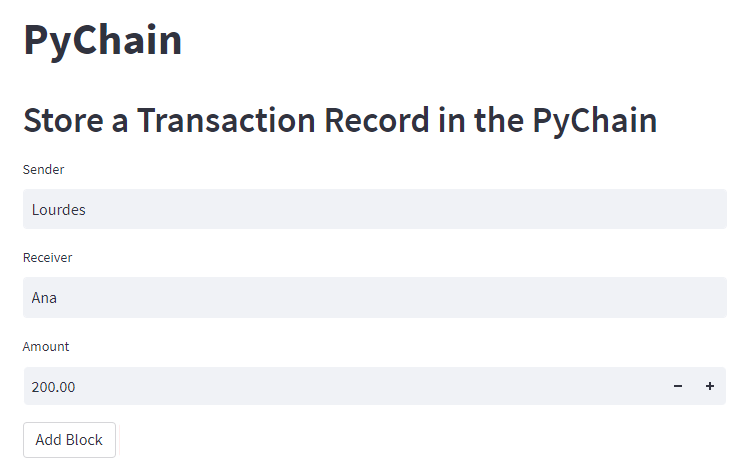
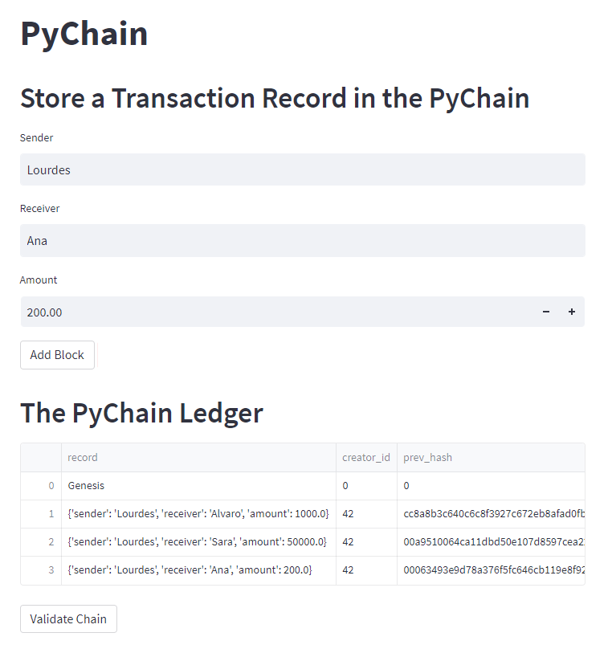
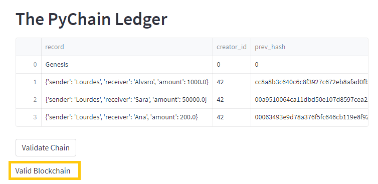

# Blockchain Ledger System

This project entails building a blockchain-based ledger system with a user-friendly web interface. This ledger should allow partner banks to conduct financial transactions (to transfer money between senders and receivers) and to verify the integrity of the data in the ledger.

In this case, four different steps are followed: 

* Creating a data class named ```Record``` that will serve as the blueprint for the financial transaction records that the blocks of the ledger will store.
* Changing the existing Block data class by replacing the generic data attribute with a record attribute that’s of type Record.
* Creating additional user input areas in the Streamlit application. These input areas should collect the relevant information for each financial record that you’ll store in the PyChain ledger.
* Testing the complete ```PyChain``` ledger.

---

## Technologies

The whole project is implemented in Python, writen in Visual Studio using Pandas and other different libraries for classes implementation: 

* ```import pandas as pd```
* ```import datetime as datetime```
* ```import hashlib```
* ```from dataclasses import dataclass```
* ```from typing import Any, List```

For the web interface and usability, we use Streamlit:

* ```!pip install streamlit```
* ```import streamlit as st```

---

## Usage

1. In the terminal, run the Streamlit application by using `streamlit run pychain.py`.

2. Enter values for the sender, receiver, and amount, and then click the "Add Block" button. Do this several times to store several blocks in the ledger.




3. Verify the block contents and hashes in the Streamlit drop-down menu. The blockchain should now consist of multiple blocks:




4. Test the blockchain validation process by using the web interface. The Streamlit application page should indicate the validity of the blockchain:




---

## Contributors

Feature developed by Lourdes Dominguez [(LinkedIn profile)](https://www.linkedin.com/in/lourdes-dominguez-bengoa-12333044/)

---

## License

Use only for academic purposes.